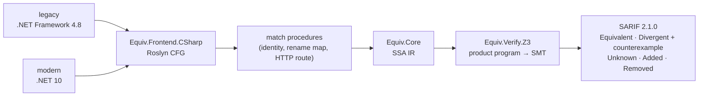

<div align="center">

# equiv

**Behavioural equivalence checker for migrated code.**<br>
It proves that before and after a migration behave the same, or shows you the input where they don't.

[](https://github.com/Zafnok/code-equivalency/actions/workflows/ci.yml)
[](https://github.com/Zafnok/code-equivalency/actions/workflows/codeql.yml)
[](https://github.com/Zafnok/code-equivalency/actions/workflows/mutation.yml)
[](https://github.com/Zafnok/code-equivalency/actions/workflows/sonar.yml)

[](https://sonarcloud.io/summary/new_code?id=Zafnok_code-equivalency)
[](https://sonarcloud.io/summary/new_code?id=Zafnok_code-equivalency)
[](https://sonarcloud.io/summary/new_code?id=Zafnok_code-equivalency)
[](https://sonarcloud.io/summary/new_code?id=Zafnok_code-equivalency)
[](https://sonarcloud.io/summary/new_code?id=Zafnok_code-equivalency)
[](https://sonarcloud.io/summary/new_code?id=Zafnok_code-equivalency)
[](https://sonarcloud.io/summary/new_code?id=Zafnok_code-equivalency)
[](https://sonarcloud.io/summary/new_code?id=Zafnok_code-equivalency)
[](https://sonarcloud.io/summary/new_code?id=Zafnok_code-equivalency)

[](global.json)
[](Directory.Build.props)
[](docs/adr/)
[](docs/VERIFICATION-MODEL.md)
[](docs/QUALITY-GATES.md)
[](docs/QUALITY-GATES.md)
[](LICENSE)

[](https://github.com/Zafnok/code-equivalency/commits/main)
[](https://github.com/Zafnok/code-equivalency/pulse)
[](https://github.com/Zafnok/code-equivalency/pulls?q=is%3Apr+is%3Aclosed)
[](https://github.com/Zafnok/code-equivalency/issues)
[](https://github.com/Zafnok/code-equivalency)
[](https://github.com/Zafnok/code-equivalency)
[](https://github.com/Zafnok/code-equivalency/stargazers)



<sub>Illustrative session built from the <code>samples/</code> READMEs, not a recording.</sub>

</div>

`equiv` proves (or refutes, with a counterexample) that a program behaves the same
before and after a migration. It does not diff syntax. It lowers both versions to a
language-neutral intermediate representation (IR), encodes matched procedure pairs as
SMT problems, and asks Z3 whether any input can make them disagree.

MVP scope: **.NET Framework 4.8 → .NET 10 (C#)**. Later: Java 11 → 25, then
cross-language rewrites. The language frontends are the only language-specific parts.

## How it works



## Status

Milestones M0 (skeleton and gates), M1 (core IR, samples, SARIF, CLI shell) and M2 (the
C# frontend) are merged, and so is M3-001, the Z3 product-program encoder for loop-free IR.
`equiv compare` loads 4.8 and .NET 10 solutions, matches procedures (including by HTTP route),
lowers them to IR and verifies the matched pairs. Loops and packaging are still to come.

M3 is in progress. It adds the loop ladder, the soundness and precision work from the pre-M3
review (ADRs 0018 to 0020), and the measurement work from the Unknown-rate and feasibility reviews
(ADRs 0024 to 0029). Success is judged on a public corpus against thresholds fixed in advance
(ADR 0028), and the first census on it decides whether the precision milestone (M4) goes ahead.
Progress and ordering: [docs/ROADMAP.md](docs/ROADMAP.md).

What exists today:

- `Equiv.Core` — SSA IR (records, validator, text dump/parse round trip, interpreter),
  CsCheck generators in `tests/Equiv.TestSupport`; verdict model (`Equivalent`,
  `Divergent` + counterexample, `Unknown` + reason, `Added`, `Removed`); procedure
  identity normalisation with rename maps; `equiv.config.json` loader; stable identity
  matcher; SARIF 2.1.0 writer with fingerprint-based `baselineState`; the
  runtime-changes table (EQ006).
- `Equiv.Frontend.CSharp` — `MSBuildWorkspace` loader, symbol enumeration, endpoint
  discovery (Web API 2 / MVC 5 / ASP.NET Core attribute routes), and lowering from
  Roslyn's CFG to IR. Coverage per `OperationKind` is in
  [docs/tickets/IOPERATION-COVERAGE.md](docs/tickets/IOPERATION-COVERAGE.md).
- `Equiv.Cli` — `equiv compare` argument parsing, frontend routing by language, exit
  codes, `--dry-run`, `--baseline`, `--fail-on`.
- `Equiv.Verify.Z3` — product-program encoder, Z3 driver and counterexample replay for loop-free
  IR (M3-001); the loop ladder is M3-002.
- `samples/` — paired 4.8/10 solutions, each README stating the expected verdicts.
- `tools/corpus/` — the public migration corpus `equiv` is assessed on (ADR 0028): a pinned copy
  of Amazon's Poly-MigrationBench .NET list (100 repos) and public before/after pairs such as Git
  Extensions' 4.8-to-.NET 5 migration. Fetched into the git-ignored `.corpus/`, run through the
  `equiv-corpus-run` skill, and summarised under `docs/runs/`. No third-party code is committed.
- Gates — 100% line and branch coverage on every `src/` project, warnings as errors,
  ArchUnitNET dependency rules, CodeQL, gitleaks, Dependabot, locked restores, a
  dependency licence gate, and Stryker mutation testing. SonarQube Cloud runs on every
  PR but is not yet a required check.

## Licence

`equiv` is **source-available, not open source**. It is licensed under the
[Business Source License 1.1](LICENSE); each version converts to Apache-2.0 on the Change
Date (2030-09-20) or four years after that version is first published, whichever is sooner.

In plain terms, production use is free while **both** of the following hold:

- no more than **3 people** use `equiv` or act on its output, and
- **no codebase you analyse exceeds 50,000 lines** (each side of a comparison is measured
  separately, so 49k against 49k is fine and 49k against 52k is not).

Using `equiv` in CI counts as production use. Non-production evaluation is free and uncapped.

**How `equiv` counts lines for the 50,000 limit.** Every `equiv compare` prints the analysed
line count of each codebase, and writes it to the SARIF run's `properties.analysedLinesOfCode`
as `legacy` and `modern`. They are two numbers, never a total, because the licence measures each
codebase on its own. The same rule applies to both sides:

- **Files:** every C# file the loaded projects compile, which is your source files plus what the
  build generates (such as `obj/**/AssemblyInfo.cs` and source-generator output). A file that
  more than one project compiles counts once.
- **Lines:** a line counts when it holds C# code. Blank lines, comment-only lines, preprocessor
  directive lines (`#if`, `#region`) and code that an inactive `#if` excludes do not count.

`equiv compare --dry-run` reports the two counts without verifying anything, so you can check
where you stand first. `equiv` only reports the numbers. It enforces nothing and sends nothing
anywhere.
Offering `equiv` as a hosted or embedded service, using it to run migrations or reviews for
third parties, or reselling it, is never permitted under this licence at any size.

[LICENSE](LICENSE) is the controlling text and this summary is not a substitute for it. For a
commercial licence, open an issue. Reasoning and the dependency licence policy are in
[ADR 0017](docs/adr/0017-licensing-and-ip.md); attribution for bundled third-party code is in
[THIRD-PARTY-NOTICES.md](THIRD-PARTY-NOTICES.md).

## Usage (current surface)

```
equiv compare --legacy <path> --modern <path>
              [--out equiv.sarif] [--baseline <previous.sarif>]
              [--config equiv.config.json] [--fail-on divergent|unknown] [--dry-run]
              [--lower-only]
```

`--dry-run` routes and loads both sides, prints the analysed line counts, and stops without
writing SARIF. `--lower-only` loads, matches and lowers, then writes a SARIF log with the
lowering census (`run.properties.loweringCensus`) and the Added and Removed results. It never
runs the solver and exits 0 unless loading fails. It cannot be combined with `--baseline` or
`--fail-on`.

| Exit code | Meaning |
|---|---|
| 0 | No new `Divergent` results (and no new `Unknown` when `--fail-on unknown`) |
| 1 | At least one `Divergent` result that is `new` relative to `--baseline` |
| 2 | `--fail-on unknown` and at least one new `Unknown` result |
| 3 | Usage error: bad arguments, missing or unparseable file, no frontend for the paths |
| 4 | A C# project was skipped because it failed to load (the SARIF lists it and is still written), or a side had no C# project that loaded (no SARIF). Outranks 1 and 2 |
| 5 | At least one pair's verification crashed (the SARIF lists it as a tool-execution notification and is still written), or any other unhandled internal error. Outranks 1, 2 and 4 |

Output is always SARIF 2.1.0 (rules EQ001 to EQ006); the exact meaning of each verdict
and of `baselineState` is in [docs/VERIFICATION-MODEL.md](docs/VERIFICATION-MODEL.md).

## Building and running the gates

```
./build.ps1               # build, format check, tests, 100% coverage gate, architecture tests
./build.ps1 -Integration  # also runs tests/Equiv.Tests.Integration (needs VS Build Tools)
```

Every gate in [docs/QUALITY-GATES.md](docs/QUALITY-GATES.md) runs locally through this
script and in GitHub Actions on every PR. Coverage flags for coverlet.MTP go after `--`
on `dotnet test`; the script already does this.

## Read in this order

1. [CLAUDE.md](CLAUDE.md) — rules for anyone (human or agent) touching this repo.
2. [docs/ARCHITECTURE.md](docs/ARCHITECTURE.md) — components, boundaries, data flow.
3. [docs/VERIFICATION-MODEL.md](docs/VERIFICATION-MODEL.md) — what "equivalent" means here, exactly.
4. [docs/QUALITY-GATES.md](docs/QUALITY-GATES.md) — the gates every change must pass.
5. [docs/ROADMAP.md](docs/ROADMAP.md) — milestones; [docs/tickets/](docs/tickets/) — the work items.
6. [docs/adr/](docs/adr/) — why each technology was chosen (and what was rejected).

## Layout

```
src/        production code, one project per component (see ARCHITECTURE.md)
tests/      one test project per src project, Equiv.TestSupport (generators),
            Equiv.Tests.Architecture, Equiv.Tests.Integration
samples/    tiny paired legacy/modern solutions used as fixtures and demos
tools/      check-coverage (100% gate), licence-check, sonar-triage, corpus (ADR 0028)
docs/       everything above; docs/runs/ holds corpus-run summaries
.corpus/    git-ignored: third-party checkouts and raw output of corpus runs
.github/    ci.yml, codeql.yml, mutation.yml, sonar.yml, dependabot.yml
.claude/    skills that encode the workflow for coding agents
```

## Prerequisites (Windows dev box, MVP)

- .NET 10 SDK (the exact patch is pinned in `global.json`).
- Visual Studio 2026 **Build Tools** with workload ".NET desktop build tools" and the
  component ".NET Framework 4.8 targeting pack". This is what lets Roslyn's out-of-process
  build host evaluate legacy (non-SDK) `.csproj` files. No Win32 API is used anywhere.
  Build Tools install under `C:\Program Files (x86)\Microsoft Visual Studio\18\BuildTools`
  (the x86 prefix, even on 64-bit Windows); net48 reference assemblies land under
  `C:\Program Files (x86)\Reference Assemblies\Microsoft\Framework\.NETFramework\v4.8`.
  Unattended install with the exact component ids:

  ```bash
  winget install --source winget Microsoft.VisualStudio.BuildTools --override "--wait --quiet --norestart --add Microsoft.VisualStudio.Workload.ManagedDesktopBuildTools --add Microsoft.Net.Component.4.8.TargetingPack --add Microsoft.Net.Component.4.8.SDK"
  ```

  Without the targeting pack, legacy projects fail to load with `CS0518` (predefined type
  not defined), not with a workspace error. `./build.ps1 -Integration` loads every sample
  and is the quickest check that the box is set up.
- Git, Docker Desktop (for the container packaging milestone), GitHub CLI.

The engine itself is cross-platform; only loading legacy `.csproj` files needs Windows
until the Linux loader exists (ADR 0031, tickets M3-028 and M3-029). CI runs the full pipeline on `windows-latest`
and everything except the integration tests on `ubuntu-latest`.

## Star history

<a href="https://star-history.com/#Zafnok/code-equivalency&Date">
  <picture>
    <source media="(prefers-color-scheme: dark)" srcset="https://api.star-history.com/svg?repos=Zafnok/code-equivalency&type=Date&theme=dark">
    
  </picture>
</a>
