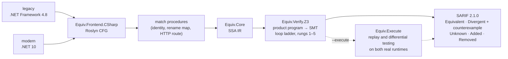

<div align="center">

# equiv

**Behavioural equivalence checker for migrated code.**<br>
It proves that before and after a migration behave the same, or shows you the input where they don't.

[](https://github.com/Zafnok/code-equivalency/actions/workflows/ci.yml)
[](https://github.com/Zafnok/code-equivalency/actions/workflows/codeql.yml)
[](https://github.com/Zafnok/code-equivalency/actions/workflows/mutation.yml)
[](https://github.com/Zafnok/code-equivalency/actions/workflows/sonar.yml)

[](https://sonarcloud.io/summary/new_code?id=Zafnok_code-equivalency)
[](https://sonarcloud.io/summary/new_code?id=Zafnok_code-equivalency)
[](https://sonarcloud.io/summary/new_code?id=Zafnok_code-equivalency)
[](https://sonarcloud.io/summary/new_code?id=Zafnok_code-equivalency)
[](https://sonarcloud.io/summary/new_code?id=Zafnok_code-equivalency)
[](https://sonarcloud.io/summary/new_code?id=Zafnok_code-equivalency)
[](https://sonarcloud.io/summary/new_code?id=Zafnok_code-equivalency)
[](https://sonarcloud.io/summary/new_code?id=Zafnok_code-equivalency)
[](https://sonarcloud.io/summary/new_code?id=Zafnok_code-equivalency)

[](global.json)
[](Directory.Build.props)
[](docs/adr/)
[](docs/VERIFICATION-MODEL.md)
[](docs/QUALITY-GATES.md)
[](docs/QUALITY-GATES.md)
[](LICENSE)

[](https://github.com/Zafnok/code-equivalency/commits/main)
[](https://github.com/Zafnok/code-equivalency/pulse)
[](https://github.com/Zafnok/code-equivalency/pulls?q=is%3Apr+is%3Aclosed)
[](https://github.com/Zafnok/code-equivalency/issues)
[](https://github.com/Zafnok/code-equivalency)
[](https://github.com/Zafnok/code-equivalency)
[](https://github.com/Zafnok/code-equivalency/stargazers)


<sub>Replayed from real <code>equiv compare</code> output at <code>cc56ae8</code> on two <code>samples/</code>; the SARIF message is wrapped and the comments are added.</sub>

</div>

`equiv` proves (or refutes, with a counterexample) that a program behaves the same
before and after a migration. It does not diff syntax. It lowers both versions to a
language-neutral intermediate representation (IR), encodes matched procedure pairs as
SMT problems, and asks Z3 whether any input can make them disagree.

MVP scope: **.NET Framework 4.8 → .NET 10 (C#)**. Next: detecting each side's runtime so that
version upgrades (net6 → net8) and same-runtime cleanups are checked too (ADR 0040). Later:
Java 11 → 25, then cross-language rewrites. The language frontends are the only
language-specific parts.

## How it works


```mermaid
flowchart LR
    L["legacy<br/>.NET Framework 4.8"] --> F["Equiv.Frontend.CSharp<br/>Roslyn CFG"]
    M["modern<br/>.NET 10"] --> F
    F --> Match["match procedures<br/>(identity, rename map, HTTP route)"]
    Match --> IR["Equiv.Core<br/>SSA IR"]
    IR --> Z3["Equiv.Verify.Z3<br/>product program → SMT<br/>loop ladder, rungs 1–5"]
    Z3 --> S["SARIF 2.1.0<br/>Equivalent · Divergent + counterexample<br/>Unknown · Added · Removed"]
    Z3 -. "--execute" .-> X["Equiv.Execute<br/>replay and differential testing<br/>on both real runtimes"]
    X -.-> S
```

## Status

As of 2026-09-28 (`cc56ae8`), the MVP is complete. M0 to M4 are merged, along with M5 (the
MCP server) and most of the first post-MVP milestone (P1). `equiv compare` loads 4.8 and .NET 10
solutions on Windows and Linux, matches procedures (including by HTTP route), lowers them to IR and
verifies each matched pair through a five-rung loop ladder. With `--execute` it also runs the code
on both real runtimes. Releases ship as a single-file binary, a container and a GitHub Action.

The first full corpus run (M4-007, [verdict](docs/runs/2026-09-27-m4-007-verdict.md)) came back
**continue** against ADR 0028's thresholds, which were fixed before any data existed:

- 83% to 100% of matched pairs were congruent (unchanged code).
- 17% to 73% of the changed pairs lowered with no opaque node (37% on Git Extensions).
- 28 of 28 hand-written seeded behaviour changes were reported Divergent or Unknown. None was
  called Equivalent.

Every ticket that run produced (P2-023 to P2-045: opaque reasons, crashes, `--execute` hangs,
replay mismatches) is merged. Two spikes have reported since. The IL-lowering spike found that
an IL fallback would make 10% of Git Extensions' changed pairs lowerable (ADR 0039, tickets
P1-014 to P1-018). The equality-saturation spike found 0%, so it was dropped.

What is open ([docs/ROADMAP.md](docs/ROADMAP.md), "P2 — Success assessment"):
- a second full corpus run to replace M4-007's now-stale rates (P2-046);
- a hand-audit of Divergent precision (P2-047);
- measuring cleanup refactorings (P2-048, P2-049, P2-058);
- detecting runtimes per side (ADR 0040, P2-053 to P2-057);
- the IL fallback;
- the hosted tier on Azure Container Apps (M6-001).

What exists today:

- `Equiv.Core` — SSA IR (records, validator, text dump/parse round trip, interpreter),
  CsCheck generators in `tests/Equiv.TestSupport`; verdict model (`Equivalent`,
  `Divergent` + counterexample, `Unknown` + reason, `Added`, `Removed`); procedure
  identity normalisation with rename maps; `equiv.config.json` loader; stable identity
  matcher; SARIF 2.1.0 writer with fingerprint-based `baselineState`; the
  runtime-changes table (EQ006).
- `Equiv.Frontend.CSharp` — `MSBuildWorkspace` loader (and, off Windows, a bare loader for
  non-SDK projects, M3-029), symbol enumeration, endpoint
  discovery (Web API 2 / MVC 5 / ASP.NET Core attribute routes), and lowering from
  Roslyn's CFG to IR. Coverage per `OperationKind` is in
  [docs/tickets/IOPERATION-COVERAGE.md](docs/tickets/IOPERATION-COVERAGE.md).
- `Equiv.Cli` — `equiv compare` (argument parsing, frontend routing by language, exit codes,
  baselines, the lowering census, run log with phase clocks and ETA) and `equiv mcp`.
- `Equiv.Verify.Z3` — product-program encoder and Z3 driver. The loop ladder has five rungs:
  bounded unrolling, lockstep relational induction, k-induction, Spacer CHC, then Z3-checked
  coupling invariants proposed from traces or by an LLM. It also does abstraction taint on counterexamples,
  caller-sufficient callee contracts, and failure refinement on every Unknown (does the modern
  side newly throw?).
- `Equiv.Execute` — the second oracle (ADR 0035). With `--execute`, every Divergent is replayed
  on .NET Framework 4.8 and .NET 10, and every Unknown pair is differentially tested on generated
  inputs. It also holds the `runtime-diff` harness (`tools/runtime-diff/`), which measures the
  BCL on both runtimes. Execution never proves a pair Equivalent.
- `samples/` — paired 4.8/10 solutions, each README stating the expected verdicts.
- `tools/corpus/` — the public migration corpus `equiv` is assessed on (ADR 0028): a pinned copy
  of Amazon's Poly-MigrationBench .NET list (100 repos) and public before/after pairs such as Git
  Extensions' 4.8-to-.NET 5 migration. Fetched into the git-ignored `.corpus/`, run through the
  `equiv-corpus-run` skill, and summarised under `docs/runs/`. No third-party code is committed.
- Gates — 100% line and branch coverage on every `src/` project, warnings as errors,
  ArchUnitNET dependency rules, CodeQL, gitleaks, Dependabot, locked restores, a
  dependency licence gate, and Stryker mutation testing. SonarQube Cloud runs on every
  PR but is not yet a required check.

## Licence

`equiv` is **source-available, not open source**. It is licensed under the
[Business Source License 1.1](LICENSE); each version converts to Apache-2.0 on the Change
Date (2030-09-20) or four years after that version is first published, whichever is sooner.

In plain terms, production use is free while **both** of the following hold:

- no more than **3 people** use `equiv` or act on its output, and
- **no codebase you analyse exceeds 50,000 lines** (each side of a comparison is measured
  separately, so 49k against 49k is fine and 49k against 52k is not).

Using `equiv` in CI counts as production use. Non-production evaluation is free and uncapped.

**How `equiv` counts lines for the 50,000 limit.** Every `equiv compare` prints the analysed
line count of each codebase, and writes it to the SARIF run's `properties.analysedLinesOfCode`
as `legacy` and `modern`. They are two numbers, never a total, because the licence measures each
codebase on its own. The same rule applies to both sides:

- **Files:** every C# file the loaded projects compile, which is your source files plus what the
  build generates (such as `obj/**/AssemblyInfo.cs` and source-generator output). A file that
  more than one project compiles counts once.
- **Lines:** a line counts when it holds C# code. Blank lines, comment-only lines, preprocessor
  directive lines (`#if`, `#region`) and code that an inactive `#if` excludes do not count.

`equiv compare --dry-run` reports the two counts without verifying anything, so you can check
where you stand first. `equiv` only reports the numbers. It enforces nothing and sends nothing
anywhere.
Offering `equiv` as a hosted or embedded service, using it to run migrations or reviews for
third parties, or reselling it, is never permitted under this licence at any size.

[LICENSE](LICENSE) is the controlling text and this summary is not a substitute for it. For a
commercial licence, open an issue. Reasoning and the dependency licence policy are in
[ADR 0017](docs/adr/0017-licensing-and-ip.md); attribution for bundled third-party code is in
[THIRD-PARTY-NOTICES.md](THIRD-PARTY-NOTICES.md).

## Usage (current surface)

```
equiv compare --legacy <solution.sln|.slnx> --modern <solution.sln|.slnx>
              [--out equiv.sarif] [--baseline <previous.sarif>]
              [--config equiv.config.json] [--fail-on divergent|unknown]
              [--dry-run] [--lower-only]
              [--execute [--test-target 0.001] [--test-budget <inputs>[,<seconds>]]]
              [--chc-int-mode true|false] [--invariant-model <id>] [--il-fallback]
              [--verbosity quiet|normal|debug] [--log <path>]
equiv mcp [--execute]
```

Both paths must be solution files (`.sln` or `.slnx`); anything else is exit 3. Stdout carries
two lines at most: `analysed lines of code: legacy=<n> modern=<n>`, and a `route:` line with
`--dry-run`. Results go only to the SARIF file.

`--dry-run` routes and loads both sides, prints the analysed line counts, and stops without
writing SARIF. `--lower-only` loads, matches and lowers, then writes a SARIF log with the
lowering census (`run.properties.loweringCensus`) and the Added and Removed results. It never
runs the solver and exits 0 unless loading fails. It cannot be combined with `--baseline` or
`--fail-on`.

`--execute` runs code from both solutions on this machine, so it needs Windows with .NET Framework
4.8 (otherwise exit 3). It replays every Divergent's counterexample on both runtimes and records
the outcome in `properties.replay`: `reproduced`, `not-reproduced`, `not-applicable` or
`not-constructible`. It also tests every Unknown pair on generated inputs, and a divergence it
sees twice becomes an EQ002 with `proofMethod: observed`. Testing a pair stops once the estimated
chance of new behaviour drops below `--test-target` (default 0.001, after at least 1,000 inputs),
or at `--test-budget` (default `10000,60`: 10,000 inputs or 60 seconds). Execution never yields
Equivalent. See [VERIFICATION-MODEL.md](docs/VERIFICATION-MODEL.md) for what each field means.

`--invariant-model <id>` lets the loop ladder ask the Claude model `<id>` for a loop invariant
when Z3 Spacer times out (rung 5). It sends the loops' IR text and needs `ANTHROPIC_API_KEY`.
Z3 checks every answer, so a wrong one can never prove a pair. It is off by default. The local
proposer, which mines invariants from runs in process and sends nothing, is on by default and
is asked first. `--chc-int-mode` (default `true`) lets rung 4 try integer arithmetic before
falling back to bitvectors.

`--il-fallback` (off by default; ADR 0039) lowers a matched pair again from IL on both sides when
it is not congruent and either side holds an opaque the other lacks, and keeps the IL bodies only
when they hold fewer such opaques. Every result on a matched pair then says which lowering it used,
in `properties.lowering` (`operation` or `il`), and the census counts `pairsIlFallbackTried` and
`pairsLoweredFromIl`.

Progress goes to stderr, never stdout (ADR 0038). `normal` prints each phase's start and end, a
line at most every 5%, and a heartbeat every 60 s that names the pair being worked on. `debug`
adds one line per item and the solver's rung timings. `quiet` prints nothing. `--log <path>`
copies the same lines to a file that is flushed line by line. The grammar is fixed, so scripts
can parse it:

```
equiv: +00:00:06 verify 1/1 (100%) eta=00:00:00.000 worst=00:00:00.000 rate=8.0/s
equiv: +00:00:06 verify done in 00:00:00.124; eta@25%=00:00:00.000 eta@50%=00:00:00.000 eta@75%=00:00:00.000 dropped=0
```

| Exit code | Meaning |
|---|---|
| 0 | No new `Divergent` results (and no new `Unknown` when `--fail-on unknown`) |
| 1 | At least one `Divergent` result that is `new` relative to `--baseline` |
| 2 | `--fail-on unknown` and at least one new `Unknown` result |
| 3 | Usage error: bad arguments, missing or unparseable file, no frontend for the paths |
| 4 | A C# project was skipped because it failed to load (the SARIF lists it and is still written), or a side had no C# project that loaded (no SARIF). Outranks 1 and 2 |
| 5 | At least one pair's lowering or verification crashed (the SARIF lists it as a tool-execution notification and is still written), or any other unhandled internal error. Outranks 1, 2 and 4 |

Output is always SARIF 2.1.0 (rules EQ001 to EQ006); the exact meaning of each verdict
and of `baselineState` is in [docs/VERIFICATION-MODEL.md](docs/VERIFICATION-MODEL.md).

A real `Divergent` result, from `equiv compare --legacy samples/added-branch/legacy/*.sln
--modern samples/added-branch/modern/*.slnx` (ticket M3-003; see `samples/added-branch/README.md`),
one result from `equiv.sarif`'s `runs[0].results`:

```json
{
  "ruleId": "EQ002",
  "level": "error",
  "message": {
    "text": "Equiv.Samples.AddedBranch.Doubler::Double(int) diverges: inputs(bv32 0) old(returned bv32 0 outs() trace()) new(returned bv32 4294967295 outs() trace())"
  },
  "properties": {
    "model": "inputs(bv32 0) old(returned bv32 0 outs() trace()) new(returned bv32 4294967295 outs() trace())",
    "ladderTrace": [
      { "rung": "bounded", "outcome": "refuted", "detail": "a divergence within 3 iterations" }
    ]
  }
}
```

The counterexample is `x = 0` (`bv32 0`): legacy returns `0`, modern returns `-1` (`bv32
4294967295` two's-complement). The exit code is 1.

An `Unknown` (EQ003) says how far it can be trusted. `properties.scope` is `line` when the pair
is equivalent unless one of the listed `relatedLocations` is reached, and `method` otherwise.
`properties.failureRefinement` says whether the solver found, or ruled out, an input on which the
modern side throws where the legacy side returns (`newFailures`), and the reverse
(`removedFailures`), each as `found`, `none-proved` or `unknown` (ADR 0037).

## Use from a coding agent

`equiv mcp` runs the same pipeline as `equiv compare` as a [Model Context Protocol](https://modelcontextprotocol.io)
server over stdio (ADR 0033), so a coding agent can ask "is my port equivalent?" while it works. It
has two read-only tools that write no file:

- `compare`: `legacy` and `modern` (solution paths, required), and optionally `config`, `baseline`,
  `bound`, `timeoutMs` and `ilFallback` (`--il-fallback`). The result is a one-line summary (`Equivalent n, Divergent n, Unknown n,
  skipped projects n, exit code k`), then the SARIF log `equiv compare` would write, as JSON text.
- `lower_only`: `legacy`, `modern` and optionally `config` and `ilFallback`; the same as `equiv compare --lower-only`.

An input error `equiv compare` exits 3 or 4 on (a missing file, no frontend for the paths, no C#
project that loads) comes back as a tool error with the same message.

`equiv mcp --execute` also registers `probe` (ADR 0035, ADR 0036; ticket M5-002), which runs code
from both solutions on this machine and so needs Windows, same as `compare --execute`: an agent that
gets Unknown back from `compare` can name a matched pair by its normalised identity and supply its
own arguments, and get back both runtimes' outcomes to test its own hunch. `probe` never writes
SARIF and never changes a `compare` result; a mismatch it reports is a hypothesis, not a proof.
Without `--execute`, or off Windows, `probe` is not registered at all, so an agent cannot turn
execution on by itself.

- `probe`: `legacy`, `modern`, `identity` and `arguments` (the method's own arguments, in order, as
  JSON values), and optionally `culture`. The result is `{ legacy: {kind, canonical}, modern: {kind,
  canonical}, equal }`. An argument that cannot be built, or an identity that matches no pair, comes
  back as a tool error naming it.

Every MCP host takes a stdio server as a command and its arguments; for the binary:

```json
{ "mcpServers": { "equiv": { "command": "equiv", "args": ["mcp"] } } }
```

and for the container, with the repository mounted so the paths you pass resolve inside it:

```
docker run -i --rm -v <repo>:/src equiv mcp
```

Only protocol messages go to stdout; the run's own progress and messages go to stderr.

## Building and running the gates

```
./build.ps1               # build, format check, tests, 100% coverage gate, architecture tests
./build.ps1 -Integration  # also runs tests/Equiv.Tests.Integration (needs VS Build Tools)
```

`Microsoft.Z3` restores only from the git-ignored local feed `.z3-feed/` (ADR 0030), which
`build.ps1` fills first. Before any direct `dotnet restore`, `dotnet build` or `dotnet test`
on a fresh clone (an IDE build included), run `./tools/z3-feed/fetch.ps1` once.

Every gate in [docs/QUALITY-GATES.md](docs/QUALITY-GATES.md) runs locally through this
script and in GitHub Actions on every PR. Coverage flags for coverlet.MTP go after `--`
on `dotnet test`; the script already does this.

## Read in this order

1. [CLAUDE.md](CLAUDE.md) — rules for anyone (human or agent) touching this repo.
2. [docs/ARCHITECTURE.md](docs/ARCHITECTURE.md) — components, boundaries, data flow.
3. [docs/VERIFICATION-MODEL.md](docs/VERIFICATION-MODEL.md) — what "equivalent" means here, exactly.
4. [docs/QUALITY-GATES.md](docs/QUALITY-GATES.md) — the gates every change must pass.
5. [docs/ROADMAP.md](docs/ROADMAP.md) — milestones; [docs/tickets/](docs/tickets/) — the work items.
6. [docs/adr/](docs/adr/) — why each technology was chosen (and what was rejected).

## Layout

```
src/        production code, one project per component (see ARCHITECTURE.md)
tests/      one test project per src project, Equiv.TestSupport (generators),
            Equiv.Tests.Architecture, Equiv.Tests.Integration
samples/    tiny paired legacy/modern solutions used as fixtures and demos
tools/      check-coverage (100% gate), licence-check, sonar-triage, corpus (ADR 0028),
            runtime-diff (BCL on both runtimes), z3-feed (ADR 0030), spikes
docs/       everything above; docs/runs/ holds corpus-run summaries
.corpus/    git-ignored: third-party checkouts and raw output of corpus runs
.github/    ci.yml, codeql.yml, mutation.yml, sonar.yml, sonar-triage.yml,
            rolling-release.yml, release.yml, dependabot.yml
.claude/    skills that encode the workflow for coding agents
```

## Prerequisites

### Windows dev box

- .NET 10 SDK (the exact patch is pinned in `global.json`).
- Visual Studio 2026 **Build Tools** with workload ".NET desktop build tools" and the
  component ".NET Framework 4.8 targeting pack". This is what lets Roslyn's out-of-process
  build host evaluate legacy (non-SDK) `.csproj` files. No Win32 API is used anywhere.
  Build Tools install under `C:\Program Files (x86)\Microsoft Visual Studio\18\BuildTools`
  (the x86 prefix, even on 64-bit Windows); net48 reference assemblies land under
  `C:\Program Files (x86)\Reference Assemblies\Microsoft\Framework\.NETFramework\v4.8`.
  Unattended install with the exact component ids:

  ```bash
  winget install --source winget Microsoft.VisualStudio.BuildTools --override "--wait --quiet --norestart --add Microsoft.VisualStudio.Workload.ManagedDesktopBuildTools --add Microsoft.Net.Component.4.8.TargetingPack --add Microsoft.Net.Component.4.8.SDK"
  ```

  Without the targeting pack, legacy projects fail to load with `CS0518` (predefined type
  not defined), not with a workspace error. `./build.ps1 -Integration` loads every sample
  and is the quickest check that the box is set up.
- Git, Docker Desktop (for the container packaging milestone), GitHub CLI.

### Linux

Off Windows, `equiv` loads legacy (non-SDK) `.csproj` files with its own bare loader and SDK-style ones through
MSBuildWorkspace on the .NET SDK (ADR 0031, ticket M3-029). A Linux host needs:

- the **.NET 10 SDK**, not only the runtime: SDK-style projects are evaluated by its MSBuild.
- **network access to the package sources** the solution's `nuget.config` names (nuget.org when it names none),
  or a pre-filled cache. `equiv` restores `packages.config` packages into the folder their HintPaths expect, and
  fetches the .NET Framework reference assemblies (`Microsoft.NETFramework.ReferenceAssemblies.<tfm>`, about
  110 MB per framework version) on first use into `$EQUIV_REFERENCE_ASSEMBLIES`, by default
  `~/.local/share/equiv/reference-assemblies`. A version already in that folder (layout
  `.NETFramework/v4.8/...`, as `tools/corpus/corpus.ps1 -Prepare` writes it) is never fetched again.
- a **`dotnet restore`** of any legacy project that uses `<PackageReference>`: the bare loader reads the
  `project.assets.json` it writes, exactly as Visual Studio's `ResolveNuGetPackageAssets` does.

No Mono, nuget.exe or MSBuild.exe is needed. A legacy project that uses MSBuild the bare loader cannot evaluate
exactly (`<Choose>`, a property function in a property it reads, a target that adds `Compile` or `Reference`
items, a COM reference, ...) is skipped with a notification naming the construct (exit 4), never loaded
approximately (ADR 0029).

CI runs the full pipeline on `windows-latest`, everything except the integration tests on `ubuntu-latest`, and a
`parity` job that fails when `equiv compare` gives different SARIF results on the two for any sample.

Linux hosts need **glibc 2.38 or newer** (Ubuntu 24.04+): the `Microsoft.Z3` 5.1.0 native
(from the official Z3Prover/z3 GitHub release, ADR 0030) is built against it. Debian 12,
Ubuntu 22.04 and Alpine are unsupported for the linux-x64 build.

## Running without cloning

Every green commit on `main` (CI, CodeQL and SonarQube Cloud) publishes a patch release
(`.github/workflows/rolling-release.yml`, then `release.yml`; versioning policy in
`.claude/skills/equiv-release`), with three ways to run `equiv` without a checkout. Every artifact carries `LICENSE` and `THIRD-PARTY-NOTICES.md`
(ADR 0017); the licence is BUSL-1.1, source-available and not open source, with a Change Date
specific to that release.

**Single-file binary.** `equiv-<version>-win-x64.zip` / `equiv-<version>-linux-x64.tar.gz` on the
GitHub release, built with `dotnet publish -r <rid>` (`PublishSingleFile`, `SelfContained`,
`IncludeNativeLibrariesForSelfExtract`; see `src/Equiv.Cli/Equiv.Cli.csproj`). Extract and run
`equiv compare ...` directly; no .NET SDK install needed. On Linux, the same [Prerequisites](#linux)
above still apply (SDK for SDK-style projects, network access for `packages.config` and reference
assemblies) except the SDK itself is bundled with the binary.

**Container.** `docker run --rm --user "$(id -u):$(id -g)" -v <samples>:/samples
ghcr.io/zafnok/equiv:<version> compare --legacy /samples/legacy/*.sln --modern
/samples/modern/*.slnx --out /samples/equiv.sarif` (mount whatever directory holds the solutions
read-write; MSBuildWorkspace writes `obj/` there). The image runs as a non-root user (uid/gid
1654, the base image's own `app` user), not root, so `--user "$(id -u):$(id -g)"` is what makes
the container's writes into your mounted directory land with your own ownership instead of
failing with "Permission denied" — the same pattern any rootless container needs for bind-mount
access. The image is the .NET SDK itself, not a runtime-only base (Dockerfile; ADR 0031), because
the SDK-style loader path shells into the SDK's own MSBuild at runtime. It holds no net4x
reference assemblies or NuGet packages; those are fetched into `$EQUIV_REFERENCE_ASSEMBLIES`
(`/data/reference-assemblies`) on first use (M3-029) — mount a volume there
(`-v equiv-ref-assemblies:/data/reference-assemblies`) to avoid re-fetching on every run. Image
size: 1.62 GB (measured locally; M3-028 measured the plain Debian `sdk:10.0` base at 917 MB, so
the `noble` base plus the app layer roughly doubles it).

**GitHub Action.** `action.yml` at the repo root runs the container (`runs.using: docker`) with
inputs `legacy`, `modern`, `config`, `baseline`, `fail-on` and output `sarif`. Follow it with
`github/codeql-action/upload-sarif` to get results into Code Scanning:

```yaml
- uses: zafnok/code-equivalency@v0.1.0
  id: equiv
  with:
    legacy: legacy
    modern: modern
- uses: github/codeql-action/upload-sarif@v4
  with:
    sarif_file: ${{ steps.equiv.outputs.sarif }}
    category: equiv
```

SonarQube can also consume the same SARIF file via `sonar.sarifReportPaths` (not integrated here;
see Out of scope in ticket M3-004).

<!--
Star history chart, hidden until the repo has stars. With 0 stars star-history.com has no data
points, so its time axis collapses to a single instant and renders a sub-second tick (".473")
instead of dates. Restore this section once the Stars badge above shows 1 or more.

## Star history

<a href="https://star-history.com/#Zafnok/code-equivalency&Date">
  <picture>
    <source media="(prefers-color-scheme: dark)" srcset="https://api.star-history.com/svg?repos=Zafnok/code-equivalency&type=Date&theme=dark">
    
  </picture>
</a>
-->

