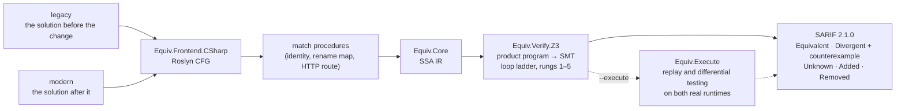

<div align="center">

# equiv

**Behavioural equivalence checker for migrated code.**<br>
It proves that before and after a migration behave the same, or shows you the input where they don't.

[](https://github.com/Zafnok/code-equivalency/actions/workflows/ci.yml)
[](https://github.com/Zafnok/code-equivalency/actions/workflows/codeql.yml)
[](https://github.com/Zafnok/code-equivalency/actions/workflows/mutation.yml)
[](https://github.com/Zafnok/code-equivalency/actions/workflows/sonar.yml)

[](https://sonarcloud.io/summary/new_code?id=Zafnok_code-equivalency)
[](https://sonarcloud.io/summary/new_code?id=Zafnok_code-equivalency)
[](https://sonarcloud.io/summary/new_code?id=Zafnok_code-equivalency)
[](https://sonarcloud.io/summary/new_code?id=Zafnok_code-equivalency)
[](https://sonarcloud.io/summary/new_code?id=Zafnok_code-equivalency)
[](https://sonarcloud.io/summary/new_code?id=Zafnok_code-equivalency)
[](https://sonarcloud.io/summary/new_code?id=Zafnok_code-equivalency)
[](https://sonarcloud.io/summary/new_code?id=Zafnok_code-equivalency)
[](https://sonarcloud.io/summary/new_code?id=Zafnok_code-equivalency)

[](global.json)
[](Directory.Build.props)
[](docs/adr/)
[](docs/VERIFICATION-MODEL.md)
[](docs/QUALITY-GATES.md)
[](docs/QUALITY-GATES.md)
[](LICENSE)

[](https://github.com/Zafnok/code-equivalency/commits/main)
[](https://github.com/Zafnok/code-equivalency/pulse)
[](https://github.com/Zafnok/code-equivalency/pulls?q=is%3Apr+is%3Aclosed)
[](https://github.com/Zafnok/code-equivalency/issues)
[](https://github.com/Zafnok/code-equivalency)
[](https://github.com/Zafnok/code-equivalency)
[](https://github.com/Zafnok/code-equivalency/stargazers)



<sub>Replayed from real <code>equiv compare</code> output at <code>cc56ae8</code> on two <code>samples/</code>; the SARIF message is wrapped and the comments are added.</sub>

</div>

`equiv` proves (or refutes, with a counterexample) that a program behaves the same
before and after a migration. It does not diff syntax. It lowers both versions to a
language-neutral intermediate representation (IR), encodes matched procedure pairs as
SMT problems, and asks Z3 whether any input can make them disagree.

Scope: **any two C# solutions on .NET Framework 4.x or .NET 3.0 and later**, whether a migration,
a version upgrade or a same-runtime change. Each side's runtime is read from its projects.
Java 11 → 25 and cross-language rewrites are planned.

## How it works


```mermaid
flowchart LR
    L["legacy<br/>the solution before the change"] --> F["Equiv.Frontend.CSharp<br/>Roslyn CFG"]
    M["modern<br/>the solution after it"] --> F
    F --> Match["match procedures<br/>(identity, rename map, HTTP route)"]
    Match --> IR["Equiv.Core<br/>SSA IR"]
    IR --> Z3["Equiv.Verify.Z3<br/>product program → SMT<br/>loop ladder, rungs 1–5"]
    Z3 --> S["SARIF 2.1.0<br/>Equivalent · Divergent + counterexample<br/>Unknown · Added · Removed"]
    Z3 -. "--execute" .-> X["Equiv.Execute<br/>replay and differential testing<br/>on both real runtimes"]
    X -.-> S
```

## What it does

- **Loads both solutions** (.NET Framework and .NET, SDK-style and legacy `.csproj`) on Windows
  or Linux.
- **Matches procedures** across the two sides by identity, by a rename map you supply in
  `equiv.config.json`, or by HTTP route (Web API 2, MVC 5 and ASP.NET Core attribute routes).
- **Proves or refutes each matched pair** with Z3. Loops go through a five-step ladder: bounded
  unrolling, lockstep relational induction, k-induction, Spacer CHC, then Z3-checked loop
  invariants.
- **Reports one verdict per pair** in SARIF 2.1.0: `Equivalent`, `Divergent` with a concrete
  counterexample, `Unknown` with a reason and a scope, `Added` or `Removed`. Known behaviour
  changes between runtimes are reported as their own rule (EQ006).
- **Ranks what to review**, grouping the Divergent and Unknown results by cause, most certain
  first.
- **Supports baselines**, so CI fails only on new findings.
- **Optionally runs the code** (`--execute`): it replays every counterexample on both real
  runtimes and tests every Unknown pair on generated inputs. Running the code never proves a pair
  Equivalent.

Which C# constructs are supported is listed in
[docs/tickets/IOPERATION-COVERAGE.md](docs/tickets/IOPERATION-COVERAGE.md). The
[`samples/`](samples/) folder holds small paired solutions, and each one's README states the
verdicts it should produce.

## Where it stands

Every number is measured on public code, and every row says when. The runs are in
[docs/runs/](docs/runs/). A row changes only when a new run measures a different value.

<!-- scoreboard:begin (edit only through .claude/skills/equiv-scoreboard) -->
| Over 3 large real pairs, 42,064 matched procedure pairs | Today | Measured |
|---|---|---|
| Proved Equivalent | 95.4% (40,122 of 42,064) | [2026-10-03](docs/runs/2026-10-03-upgrade-verdict.md) |
| Equivalent by congruence (no solver) | 94.6% (39,812 of 42,064) | [2026-10-03](docs/runs/2026-10-03-upgrade-verdict.md) |
| Changed pairs the solver proves | 13.8% (310 of 2,246) | [2026-10-03](docs/runs/2026-10-03-upgrade-verdict.md) |
| Unknown | 3.5% of pairs (1,471), 65.5% of changed pairs. Opaque construct 733, solver budget 400, abstraction 246, unaligned loop 89, recursion 3 | [2026-10-03](docs/runs/2026-10-03-upgrade-verdict.md) |
| Divergent | 1.1% of pairs (465), 20.7% of changed pairs | [2026-10-03](docs/runs/2026-10-03-upgrade-verdict.md) |
| Divergent precision (a Divergent is a real behaviour change) | Migration 3.8% (2 of 52). Upgrades 3.8% (5 of 131). Cleanups 0% (0 of 51) | [2026-09-30](docs/runs/2026-09-30-divergent-audit.md), [2026-10-03](docs/runs/2026-10-03-upgrade-verdict.md), [2026-10-02](docs/runs/2026-10-02-cleanup-verdict.md) |
| Left for a reviewer (Unknown and Divergent) | 4.6% of pairs (1,936) | [2026-10-03](docs/runs/2026-10-03-upgrade-verdict.md) |
| Soundness | 0 of 28 seeded behaviour changes reported Equivalent. No false Equivalent found on a real pair. 1 open soundness ticket ([P2-127](docs/tickets/done/P2-127-soundness-local-function-call-is-an-unverified-callee.md)) | [2026-09-30](docs/runs/2026-09-30-full-verdict.md) |
| Large pairs that run to a result | 5 of 5 | 2026-10-03 ([Duplicati](docs/tickets/done/P2-082-pair-weighting-crash-ends-the-run.md), [OpenRA](docs/tickets/done/P2-125-tuple-array-sort-mismatch-on-element-names.md)) |
| Run time, one large pair | mean 1h36m (1h11m to 2h05m), one pair at a time | [2026-10-03](docs/runs/2026-10-03-upgrade-verdict.md) |
| Repeatability | 99.94% (13,734 of 13,742 results equal between two runs) | [2026-10-02](docs/runs/2026-10-02-pair-time.md) |
<!-- scoreboard:end -->

**The three large runs behind those rows**, each a real pull request:

| | Git Extensions, .NET Framework 4.8 to .NET 5 | Git Extensions, .NET 5 to .NET 6 | Jellyfin, .NET 8 to .NET 9 | All three |
|---|---|---|---|---|
| Analysed lines per side | 187,000 | 189,000 | 156,000 | |
| Matched procedure pairs | 13,541 | 14,020 | 14,503 | 42,064 |
| Equivalent by congruence (both bodies lower to the same IR and no runtime change applies; no solver) | 93.0% | 94.8% | 96.0% | **94.6%** |
| Equivalent by the solver | 0.5% (71) | 1.7% (239) | 0% (0) | **0.7%** |
| Divergent | 2.2% (292) | 0.4% (62) | 0.8% (111) | **1.1%** |
| Unknown | 4.3% (588) | 3.0% (421) | 3.2% (462) | **3.5%** |
| Wall-clock | 2h05m | 1h11m | 1h32m | **mean 1h36m** |

So a reviewer is spared about 95% of the procedures and is handed the rest, grouped by cause.

**The changed pairs are where the work is left.** Of the 2,246 pairs that are not congruent, the
solver proves 310 (13.8%) Equivalent: 7.5%, 33.1% and 0% on the three runs. 65.5% are Unknown and
20.7% are Divergent. Most changed pairs on the two upgrades are in files the pull request did not
touch: a runtime rule or a rebound call took them out of congruence.

The Unknowns of the three runs by reason: opaque construct 733, solver budget 400, abstraction
246, unaligned loop 89, recursion 3.

Other pairs, for range:

| Pair | Congruent share | Changed pairs the solver proves |
|---|---|---|
| Three agent migrations of small repositories (median) | 98.5% | too few changed pairs to say |
| Three "no functional change" cleanup pull requests (Git Extensions, PowerShell) | 97.6% to 99.6% | 9.9% (57 of 575) |
| The collection-expression cleanup, on the branch of [Zafnok/code-equivalency#368](https://github.com/Zafnok/code-equivalency/pull/368) | 97.6% | 45.6% (160 of 351), from 2.0% on `main` |
| Duplicati and OpenRA migrations (69,000 and 131,000 lines) | 85.0% and 95.8% | both now run to a result (3h26m and 1h10m); their rates are not summarised yet |

**Run time.** Pairs are verified one at a time, and the time follows the number of changed pairs,
not the number of lines. The mean of the three runs above is 1h36m (the two upgrades shared one
machine). Before the fix that removed non-solver time from a pair, the same three took 2h43m,
6h47m and more than 12 hours.

| Run | Analysed lines per side | Changed pairs | Wall-clock |
|---|---|---|---|
| Git Extensions, 4.8 to .NET 5 | 187,000 | 951 | 2h05m (verify 81 min, callee contracts 41 min, lowering 98 s) |
| Jellyfin, .NET 8 to .NET 9 | 156,000 | 573 | 1h32m |
| Git Extensions, .NET 5 to .NET 6 | 189,000 | 722 | 1h11m |
| Git Extensions cleanup, collection expressions (on the branch of pull request 368) | 195,000 | 351 | 31 min |
| PowerShell cleanup | 464,000 | 140 | 5 min |
| Agent migrations | 400 to 7,600 | 0 to 40 | 8 s to 2 min |

**How close to usable.** The success criteria fixed before the first run
([ADR 0028](docs/adr/0028-public-corpus-and-success-criteria.md)) are all met: every project
loads, more than 40% of pairs are unchanged, and 28 of 28 seeded behaviour changes were caught,
none reported Equivalent. On the two upgrades, no behaviour change the pull request made was
reported Equivalent either. An Equivalent can be relied on today, with one known exception: a member
that calls a local function by name is proved without the local function's body being read
([P2-127](docs/tickets/done/P2-127-soundness-local-function-call-is-an-unverified-callee.md)).
The rest cannot yet:

| What is needed | Today |
|---|---|
| A Divergent is usually a real behaviour change | Of those audited and decided: 2 of 52 on the migration (3.8%), 5 of 131 on the upgrades (3.8%), 0 of 51 on cleanups. Counterexample results alone do better on the upgrades (5 of 8). One cause, runtime rules with no version they changed in, is 120 of the upgrades' 126 false positives and is not fixed. Three other causes have fixes in open pull requests; one of them takes the collection-expression cleanup from 25 Divergent to 3 |
| The solver decides most changed pairs | 13.8% proved on the three large runs, 9.9% on cleanups |
| Every large pair completes | Five of five. Duplicati and OpenRA now finish with no crashed pair. The three runs in the table above each lost one to three pairs to a lowering crash, fixed since and not yet run again |
| The same run gives the same results | 13,734 of 13,742 results agree between two runs |
| A run fits in a CI job | 1h11m to 2h05m, one pair at a time. Verifying pairs in parallel is not built |

In short: the sound half (congruence, no false Equivalent on seeded or real changes) is done, and
the precise half (few false Divergents, few Unknowns on changed code) is early.

## Licence

`equiv` is **source-available, not open source**. It is licensed under the
[Business Source License 1.1](LICENSE); each version converts to Apache-2.0 on the Change
Date (2030-09-20) or four years after that version is first published, whichever is sooner.

In plain terms, production use is free while **both** of the following hold:

- no more than **3 people** use `equiv` or act on its output, and
- **no codebase you analyse exceeds 50,000 lines** (each side of a comparison is measured
  separately, so 49k against 49k is fine and 49k against 52k is not).

Using `equiv` in CI counts as production use. Non-production evaluation is free and uncapped.

**How `equiv` counts lines for the 50,000 limit.** Every `equiv compare` prints the analysed
line count of each codebase, and writes it to the SARIF run's `properties.analysedLinesOfCode`
as `legacy` and `modern`. They are two numbers, never a total, because the licence measures each
codebase on its own. The same rule applies to both sides:

- **Files:** every C# file the loaded projects compile, which is your source files plus what the
  build generates (such as `obj/**/AssemblyInfo.cs` and source-generator output). A file that
  more than one project compiles counts once.
- **Lines:** a line counts when it holds C# code. Blank lines, comment-only lines, preprocessor
  directive lines (`#if`, `#region`) and code that an inactive `#if` excludes do not count.

`equiv compare --dry-run` reports the two counts without verifying anything, so you can check
where you stand first. `equiv` only reports the numbers. It enforces nothing and sends nothing
anywhere.
Offering `equiv` as a hosted or embedded service, using it to run migrations or reviews for
third parties, or reselling it, is never permitted under this licence at any size.

[LICENSE](LICENSE) is the controlling text and this summary is not a substitute for it. For a
commercial licence, open an issue. Reasoning and the dependency licence policy are in
[ADR 0017](docs/adr/0017-licensing-and-ip.md); attribution for bundled third-party code is in
[THIRD-PARTY-NOTICES.md](THIRD-PARTY-NOTICES.md).

## Usage

```
equiv compare --legacy <solution.sln|.slnx> --modern <solution.sln|.slnx>
              [--out equiv.sarif] [--baseline <previous.sarif>]
              [--config equiv.config.json] [--fail-on divergent|unknown]
              [--mode thorough|quick]
              [--dry-run] [--lower-only]
              [--execute [--test-target 0.001] [--test-budget <inputs>[,<seconds>]]]
              [--chc-int-mode true|false] [--invariant-model <id>] [--il-fallback]
              [--resource-limit <n>] [--jobs <n>]
              [--verbosity quiet|normal|debug] [--log <path>]
equiv mcp [--execute]
```

`--legacy` is the solution before the change and `--modern` the solution after it; `--before` and
`--after` are aliases, and giving both spellings of one option is exit 3.
Both paths must be solution files (`.sln` or `.slnx`); anything else is exit 3. Stdout carries
`analysed lines of code: legacy=<n> modern=<n>`, a `route:` line with `--dry-run`, and after a run
that verifies, the review list: `review list: <G> groups for <R> flagged results` and its ten
highest-ranked groups, one line each (the Divergent and Unknown results grouped by cause, most
certain first; `docs/VERIFICATION-MODEL.md` section 6). Results go only to the SARIF file, which
holds the whole list in `run.properties.reviewList`.

`--dry-run` routes and loads both sides, prints the analysed line counts, and stops without
writing SARIF. `--lower-only` loads, matches and lowers, then writes a SARIF log with the
lowering census (`run.properties.loweringCensus`) and the Added and Removed results. It never
runs the solver and exits 0 unless loading fails. It cannot be combined with `--baseline` or
`--fail-on`.

`--execute` runs code from both solutions on this machine, each side on the runtime its projects
target, which must be installed. It needs Windows only when a side targets .NET Framework
(otherwise exit 3). It replays every Divergent's counterexample on both runtimes and records
the outcome in `properties.replay`: `reproduced`, `not-reproduced`, `not-applicable` or
`not-constructible`. With `--mode thorough` it also tests every Unknown pair on generated inputs, and a divergence it
sees twice becomes an EQ002 with `proofMethod: observed`. Testing a pair stops once the estimated
chance of new behaviour drops below `--test-target` (default 0.001, after at least 1,000 inputs),
or at `--test-budget` (default `10000,60`: 10,000 inputs or 60 seconds). Execution never yields
Equivalent. See [VERIFICATION-MODEL.md](docs/VERIFICATION-MODEL.md) for what each field means.

`--invariant-model <id>` lets the loop ladder ask the Claude model `<id>` for a loop invariant
when Z3 Spacer times out (rung 5). It sends the loops' IR text and needs `ANTHROPIC_API_KEY`.
Z3 checks every answer, so a wrong one can never prove a pair. It is off by default. The local
proposer, which mines invariants from runs in process and sends nothing, is on by default and
is asked first. `--chc-int-mode` (default `true`) lets rung 4 try integer arithmetic before
falling back to bitvectors.

`--mode quick|thorough` (default `quick`; the config key `mode`, which the option overrides) chooses how much
machine time a run spends to leave fewer Unknowns (ADR 0049, ADR 0052). Both modes run the same first pass, and
`quick` stops there. `thorough` then
verifies again only the pairs that are still Unknown: with a larger bound and budget (`bound` 8, `resourceLimit`
30,000,000, `timeoutMs` 600,000; the config's `escalation` replaces them) when a query ran out of budget or the pair
has a loop, and then from IL when a pair holds an opaque the other side lacks. It also asks whether either side of a
`timeout` Unknown can fail where the other does not, runs the contracts pass, and, under `--execute`, tests every
Unknown. No verdict means anything
different in either mode: quick answers Unknown where thorough may decide, never the reverse.

Quick is the default because thorough is expensive for what it adds. On Git Extensions PR #8522 (13,541 matched
pairs, four threads) quick takes 17 minutes and thorough 10.3 hours. For that, thorough proves one more pair
Equivalent, reports 41 more Divergent and leaves 42 fewer Unknown, and it never changes a result quick decided. Some
of its extra Divergents are false: read from IL, two runtimes' different bindings of the same source (an
interpolated string, say) are different calls. Ask for `--mode thorough` when a run can take a night and every
remaining Unknown is worth the machine time, and review a result marked `decidedBy: il-pass` before trusting it. A result a later pass
produced says so in `properties.decidedBy` (`budget-pass` or `il-pass`), the run records its mode and budgets in
`run.properties.mode`, and a `--baseline` written in the other mode is a warning. A mode never turns on `--execute`
or `--invariant-model`.

`--resource-limit <n>` overrides the config's `resourceLimit` (default 2,000,000), the budget of each
solver query in Z3's own step count. It is deterministic, so a pair that runs out of it is
Unknown (`timeout`) on every run, whatever the machine's speed or load. The config's `timeoutMs`
(default 60000) is the wall-clock backstop behind it. The Unknown's message says which of the two
was hit.

`--jobs <n>` overrides the config's `jobs` (default 1), the number of matched
pairs verified at once. It changes how long a run takes, not its results: they are written in the
order `--jobs 1` writes them, and on `n` threads each query gets `n` times `timeoutMs` on the clock,
so threads sharing a processor do not time out a query that one thread would finish.
`run.properties.queryEndings` counts the queries each of the two limits ended.

A second solver is optional (ADR 0050). With `"solvers": { "cvc5": { "path": "<cvc5 executable>" } }`
in the config, a rung 1 query Z3 gives up on is also asked of [cvc5](https://cvc5.github.io), run as
a process. An `unsat` from it is taken; a `sat` only gives values, from which Z3 completes a model
that is replayed like any other. Results it helped decide say `proofMethod: bounded+cvc5`. `equiv`
ships no cvc5: its release binary links LGPL libraries, so you install it yourself
(`tools/cvc5/fetch.ps1` fetches the release this repo tests against). Without the setting nothing
changes.

`--il-fallback` (off by default) adds IL lowering to `--mode quick`: it lowers a matched pair again from IL on both sides when
it is not congruent and either side holds an opaque the other lacks, and keeps the IL bodies only
when they hold fewer such opaques. (`--mode thorough` reads such a pair from IL anyway, as a later pass and only while it is
Unknown.) Every result on a matched pair then says which lowering it used,
in `properties.lowering` (`operation` or `il`), and the census counts `pairsIlFallbackTried` and
`pairsLoweredFromIl`.

Progress goes to stderr, never stdout. `normal` prints each phase's start and end, a
line at most every 5%, and a heartbeat every 60 s that names the pair being worked on. `debug`
adds one line per item, the solver's rung timings, and each pair's time by stage (encoding,
inlining, every solver query with its answer, disposal). `quiet` prints nothing. `--log <path>`
copies the same lines to a file that is flushed line by line. The grammar is fixed, so scripts
can parse it:

```
equiv: +00:00:06 verify 1/1 (100%) eta=00:00:00.000 worst=00:00:00.000 rate=8.0/s
equiv: +00:00:06 verify done in 00:00:00.124; eta@25%=00:00:00.000 eta@50%=00:00:00.000 eta@75%=00:00:00.000 dropped=0
```

| Exit code | Meaning |
|---|---|
| 0 | No new `Divergent` results (and no new `Unknown` when `--fail-on unknown`) |
| 1 | At least one `Divergent` result that is `new` relative to `--baseline` |
| 2 | `--fail-on unknown` and at least one new `Unknown` result |
| 3 | Usage error: bad arguments, missing or unparseable file, no frontend for the paths |
| 4 | A C# project was skipped because it failed to load (the SARIF lists it and is still written), or a side had no C# project that loaded (no SARIF). Outranks 1 and 2. A modern project that loads but does not compile is not skipped: its methods that do not bind are `Unknown` results with reason `unbound`, the rest are compared, and the exit code is 0, 1 or 2 as the verdicts say |
| 5 | At least one pair's lowering or verification crashed (the SARIF lists it as a tool-execution notification and is still written), or any other unhandled internal error. Outranks 1, 2 and 4 |

Output is always SARIF 2.1.0 (rules EQ001 to EQ006); the exact meaning of each verdict
and of `baselineState` is in [docs/VERIFICATION-MODEL.md](docs/VERIFICATION-MODEL.md).

A real `Divergent` result, from `equiv compare --legacy samples/added-branch/legacy/*.sln
--modern samples/added-branch/modern/*.slnx` (see `samples/added-branch/README.md`),
one result from `equiv.sarif`'s `runs[0].results`:

```json
{
  "ruleId": "EQ002",
  "level": "error",
  "message": {
    "text": "Equiv.Samples.AddedBranch.Doubler::Double(int) diverges: inputs(bv32 0) old(returned bv32 0 outs() trace()) new(returned bv32 4294967295 outs() trace()). Equivalent when x != 0."
  },
  "properties": {
    "model": "inputs(bv32 0) old(returned bv32 0 outs() trace()) new(returned bv32 4294967295 outs() trace())",
    "agreesWhen": {
      "smt": "(not (= in.x (_ bv0 32)))",
      "text": "x != 0",
      "proposedBy": "harvested-predicates",
      "proofMethod": "bounded"
    },
    "ladderTrace": [
      { "rung": "bounded", "outcome": "refuted", "detail": "a divergence within 3 iterations" }
    ]
  }
}
```

The counterexample is `x = 0` (`bv32 0`): legacy returns `0`, modern returns `-1` (`bv32
4294967295` two's-complement). `agreesWhen` says that is the only way the pair differs: it is proved
equivalent for every `x != 0`. The exit code is 1.

An `Unknown` (EQ003) says how far it can be trusted. `properties.scope` is `line` when the pair
is equivalent unless one of the listed `relatedLocations` is reached, and `method` otherwise.
`properties.failureRefinement` says whether the solver found, or ruled out, an input on which the
modern side throws where the legacy side returns (`newFailures`), and the reverse
(`removedFailures`), each as `found`, `none-proved` or `unknown`.

A result that is not Equivalent can also say where the pair does agree. A `Divergent` (EQ002), or
an `Unknown` whose divergence rests on an abstraction, carries `properties.agreesWhen` when the
solver proved the pair equivalent under a condition on its inputs, and its message ends with
`Equivalent when <text>.` For the dropped guard of `samples/removed-null-check` that is
`name != null`, so the only question left for the reviewer is whether `null` can arrive. The
condition is a predicate one of the two bodies already computes; the verdict and the exit code stay
what they were, and nothing is claimed about the inputs outside it.

## Use from a coding agent

`equiv mcp` runs the same pipeline as `equiv compare` as a [Model Context Protocol](https://modelcontextprotocol.io)
server over stdio, so a coding agent can ask "is my port equivalent?" while it works. It
has two read-only tools that write no file:

- `compare`: `legacy` and `modern` (solution paths, required), and optionally `config`, `baseline`,
  `bound`, `timeoutMs`, `ilFallback` (`--il-fallback`) and `mode` (`--mode`). The result is a short summary (`Equivalent n, Divergent n, Unknown n,
  skipped projects n, exit code k`, then the review list's lines), then the SARIF log `equiv compare` would write, as JSON text.
- `lower_only`: `legacy`, `modern` and optionally `config` and `ilFallback`; the same as `equiv compare --lower-only`.

An input error `equiv compare` exits 3 or 4 on (a missing file, no frontend for the paths, no C#
project that loads) comes back as a tool error with the same message.

`equiv mcp --execute` also registers `probe`, which runs code
from both solutions on this machine and so needs Windows for a .NET Framework side, same as
`compare --execute`: an agent that
gets Unknown back from `compare` can name a matched pair by its normalised identity and supply its
own arguments, and get back both runtimes' outcomes to test its own hunch. `probe` never writes
SARIF and never changes a `compare` result; a mismatch it reports is a hypothesis, not a proof.
Without `--execute`, `probe` is not registered at all, so an agent cannot turn execution on by
itself.

- `probe`: `legacy`, `modern`, `identity` and `arguments` (the method's own arguments, in order, as
  JSON values), and optionally `culture`. The result is `{ legacy: {kind, canonical}, modern: {kind,
  canonical}, equal }`. An argument that cannot be built, or an identity that matches no pair, comes
  back as a tool error naming it.

Every MCP host takes a stdio server as a command and its arguments; for the binary:

```json
{ "mcpServers": { "equiv": { "command": "equiv", "args": ["mcp"] } } }
```

and for the container, with the repository mounted so the paths you pass resolve inside it:

```
docker run -i --rm -v <repo>:/src equiv mcp
```

Only protocol messages go to stdout; the run's own progress and messages go to stderr.

## Installing

Each release has three ways to run `equiv` without a checkout. Every commit on `main` that passes
CI is published as a patch release. Every artifact carries `LICENSE` and `THIRD-PARTY-NOTICES.md`.
The licence is BUSL-1.1 (source-available, not open source), and each release has its own Change
Date.

**Single-file binary.** Download `equiv-<version>-win-x64.zip` or `equiv-<version>-linux-x64.tar.gz`
from the GitHub release, extract it and run `equiv compare ...` directly. The
[requirements](#requirements) below still apply.

**Container.**

```bash
docker run --rm --user "$(id -u):$(id -g)" -v <dir>:/samples ghcr.io/zafnok/equiv:<version> compare --legacy /samples/legacy/<name>.sln --modern /samples/modern/<name>.slnx --out /samples/equiv.sarif
```

Mount the directory that holds the solutions read-write, because loading writes `obj/` there.
The image runs as a non-root user (uid/gid 1654), so `--user "$(id -u):$(id -g)"` makes its
writes into your mounted directory land with your own ownership instead of failing with
"Permission denied". The image is based on the .NET SDK, because SDK-style projects are evaluated
by the SDK's MSBuild, and is about 1.6 GB. It holds no .NET Framework reference assemblies or
NuGet packages. Those are fetched into `$EQUIV_REFERENCE_ASSEMBLIES`
(`/data/reference-assemblies`) on first use, so mount a volume there
(`-v equiv-ref-assemblies:/data/reference-assemblies`) to avoid fetching them on every run.

**GitHub Action.** `action.yml` at the repo root runs the container with inputs `legacy`,
`modern`, `config`, `baseline`, `fail-on` and `mode`, and output `sarif`. Follow it with
`github/codeql-action/upload-sarif` to get the results into Code Scanning:

```yaml
- uses: zafnok/code-equivalency@v0.1.0
  id: equiv
  with:
    legacy: legacy
    modern: modern
- uses: github/codeql-action/upload-sarif@v4
  with:
    sarif_file: ${{ steps.equiv.outputs.sarif }}
    category: equiv
```

SonarQube can also read the same SARIF file through `sonar.sarifReportPaths`.

## Requirements

### Windows

- The .NET 10 SDK.
- Visual Studio 2026 **Build Tools** with the workload ".NET desktop build tools" and the
  component ".NET Framework 4.8 targeting pack". This is what lets `equiv` load legacy
  (non-SDK) `.csproj` files. Build Tools install under
  `C:\Program Files (x86)\Microsoft Visual Studio\18\BuildTools` (the x86 prefix, even on 64-bit
  Windows), and the net48 reference assemblies land under
  `C:\Program Files (x86)\Reference Assemblies\Microsoft\Framework\.NETFramework\v4.8`.
  Unattended install with the exact component ids:

  ```bash
  winget install --source winget Microsoft.VisualStudio.BuildTools --override "--wait --quiet --norestart --add Microsoft.VisualStudio.Workload.ManagedDesktopBuildTools --add Microsoft.Net.Component.4.8.TargetingPack --add Microsoft.Net.Component.4.8.SDK"
  ```

  Without the targeting pack, legacy projects fail to load with `CS0518` (predefined type
  not defined), not with a workspace error.

### Linux

Off Windows, `equiv` loads legacy (non-SDK) `.csproj` files with its own loader, and SDK-style
ones through MSBuild on the .NET SDK. A Linux host needs:

- the **.NET 10 SDK**, not only the runtime: SDK-style projects are evaluated by its MSBuild.
- **glibc 2.38 or newer** (Ubuntu 24.04+), which the bundled Z3 native library is built against.
  Debian 12, Ubuntu 22.04 and Alpine are not supported.
- **network access to the package sources** the solution's `nuget.config` names (nuget.org when
  it names none), or a pre-filled cache. `equiv` restores `packages.config` packages into the
  folder their HintPaths expect, and on first use fetches the .NET Framework reference assemblies
  (`Microsoft.NETFramework.ReferenceAssemblies.<tfm>`, about 110 MB per framework version) into
  `$EQUIV_REFERENCE_ASSEMBLIES`, by default `~/.local/share/equiv/reference-assemblies`. A
  version already in that folder (layout `.NETFramework/v4.8/...`) is never fetched again.
- a **`dotnet restore`** of any legacy project that uses `<PackageReference>`: the loader reads
  the `project.assets.json` it writes, exactly as Visual Studio's `ResolveNuGetPackageAssets`
  does.

No Mono, nuget.exe or MSBuild.exe is needed. A legacy project that uses MSBuild the loader cannot
evaluate exactly (`<Choose>`, a property function in a property it reads, a target that adds
`Compile` or `Reference` items, a COM reference, ...) is skipped with a notification naming the
construct (exit 4), never loaded approximately.

CI fails any change for which `equiv compare` gives different SARIF results on Windows and Linux
for any sample.

## Building from source

Requires the .NET 10 SDK (the exact patch is pinned in `global.json`) and, on Windows, the Build
Tools above.

```
./build.ps1               # build, format check, tests, 100% coverage gate, architecture tests
./build.ps1 -Integration  # also runs tests/Equiv.Tests.Integration (needs VS Build Tools)
```

`Microsoft.Z3` restores only from the git-ignored local feed `.z3-feed/`, which `build.ps1`
fills first. Before any direct `dotnet restore`, `dotnet build` or `dotnet test` on a fresh clone
(an IDE build included), run `./tools/z3-feed/fetch.ps1` once. `./build.ps1 -Integration` loads
every sample and is the quickest check that a Windows box is set up.

```
src/        production code, one project per component (see docs/ARCHITECTURE.md)
tests/      one test project per src project, plus architecture and integration tests
samples/    small paired legacy/modern solutions used as fixtures and demos
tools/      build and gate tooling
docs/       architecture, verification model, quality gates, decision records
```

## Further reading

- [docs/VERIFICATION-MODEL.md](docs/VERIFICATION-MODEL.md): what "equivalent" means here, exactly.
- [docs/ARCHITECTURE.md](docs/ARCHITECTURE.md): components, boundaries and data flow.
- [docs/QUALITY-GATES.md](docs/QUALITY-GATES.md): the gates every change must pass.
- [docs/adr/](docs/adr/): why each technology was chosen, and what was rejected.

<!--
Star history chart, hidden until the repo has stars. With 0 stars star-history.com has no data
points, so its time axis collapses to a single instant and renders a sub-second tick (".473")
instead of dates. Restore this section once the Stars badge above shows 1 or more.

## Star history

<a href="https://star-history.com/#Zafnok/code-equivalency&Date">
  <picture>
    <source media="(prefers-color-scheme: dark)" srcset="https://api.star-history.com/svg?repos=Zafnok/code-equivalency&type=Date&theme=dark">
    
  </picture>
</a>
-->

